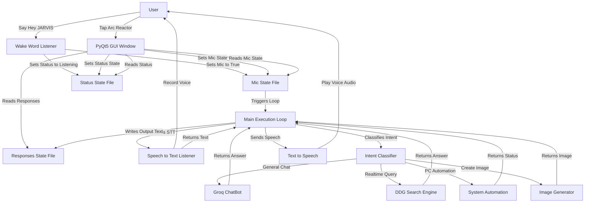

#  JARVIS AI

JARVIS AI is a highly advanced, responsive virtual assistant application built with Python and PyQt5. Inspired by Tony Stark's assistant, JARVIS features a stunning futuristic graphical user interface, background wake word activation, real-time web search capabilities, system automation, and natural speech synthesis.

<p align="center">
  
</p>

---

## ⚡ Features

*   🖥️ **Tony Stark GUI:** Sleek dark-mode interface featuring a dynamic centered visualizer.
*   🔵 **Arc Reactor Mic Indicator:** Glowing blue reactor when listening; turns dark metal in standby.
*   🎙️ **"Hey JARVIS" Wake Word:** Background voice listener to wake him up automatically.
*   🧠 **Smart Intent Router:** Uses AI to instantly classify and execute your voice commands.
*   🌐 **Live Web Search:** Searches the internet in real-time to answer live questions.
*   🤖 **PC Automation:** Voice commands to open/close apps, change volume, and set reminders.
*   🎨 **AI Image Creation:** Create paintings and visuals via local HuggingFace scripts.
*   🗣️ **Natural Speech:** High-fidelity, human-like voice synthesis using Microsoft Edge-TTS.

---

## 🛠️ Technology Stack

| Component | Technology |
| :--- | :--- |
| **Graphical Interface** | PyQt5 |
| **Main AI Chatbot** | Groq (Llama 3.3) |
| **Decision/Routing AI** | Cohere |
| **Voice Synthesis** | Microsoft Edge-TTS |
| **Voice Recognition** | Headless Chrome (Selenium) |
| **Wake Word Listener** | PyAudio & SpeechRecognition |
| **System Automation** | Python OS, Keyboard, & PyWhatKit |

---

## 📊 System Architecture & Workflow



---

## 📁 File Structure

```text
JARVIS AI/
├── Backend/
│   ├── Automation.py            # Opens/closes apps, searches Google/YouTube, system controls
│   ├── Chatbot.py               # Connects with Groq LLM to handle conversational chat
│   ├── ImageGeneration.py       # Handles AI image generation tasks
│   ├── Model.py                 # Cohere Intent Classifier (DMM)
│   ├── RealTime_Search_Engine.py# DuckDuckGo search + Groq answer compiler
│   ├── SpeechToText.py          # Selenium-based voice-to-text listener
│   └── TextToSpeech.py          # Converts textual outputs into Edge-TTS speech
├── Data/
│   ├── ChatLog.json             # Conversational message log storage
│   ├── Database.data            # Holds formatted chat history
│   ├── Mic.data                 # Real-time state file of the microphone (True/False)
│   ├── Responses.data           # Temporary storage for assistant text response
│   ├── Status.data              # System status state ("Available...", "Listening...")
│   └── Voice.html               # Headless browser HTML listener template
├── Frontend/
│   ├── Files/                   # GUI visual assets (Icons, JPGs, GIFs)
│   └── Graphics/
│       └── GUI.py               # Main PyQt5 application graphical layout & window events
├── .env                         # Local environment configuration (API keys & User configs)
├── .gitignore                   # Safe configuration ignoring venv, .env, and Data/
├── Main.py                      # Multi-threaded program runner and task coordinator
└── Requirements.txt             # Project library dependency list
```

---

## 🚀 Installation & Setup

### Prerequisites
*   Python 3.13 or lower installed
*   Google Chrome installed
*   PortAudio installed on your system:
    *   **macOS (via Homebrew):** `brew install portaudio`
    *   **Debian/Ubuntu:** `sudo apt-get install portaudio19-dev`

### Installation Steps
1.  **Clone the repository:**
    ```bash
    git clone https://github.com/Himanshu-Singh11/JARVIS-AI.git
    cd JARVIS-AI
    ```

2.  **Set up Virtual Environment:**
    ```bash
    python3 -m venv venv
    source venv/bin/activate  # On Windows: venv\Scripts\activate
    ```

3.  **Install dependencies:**
    ```bash
    pip install -r Requirements.txt
    ```

4.  **Create `.env` Configuration file:**
    Create a `.env` file in the root folder and add your keys:
    ```ini
    GroqAPIKey=your_groq_api_key_here
    CohereAPIKey=your_cohere_api_key_here
    HuggingFaceAPIKey=your_huggingface_api_key_here
    Username=Your_Name
    Assistantname=JARVIS
    InputLanguage=en
    OutputLanguage=en
    AssistantVoice=en-CA-LiamNeural
    ```

5.  **Run JARVIS:**
    ```bash
    python Main.py
    ```

---

## 🔒 License
This project is open-source. Please feel free to use and adapt it for personal projects!
