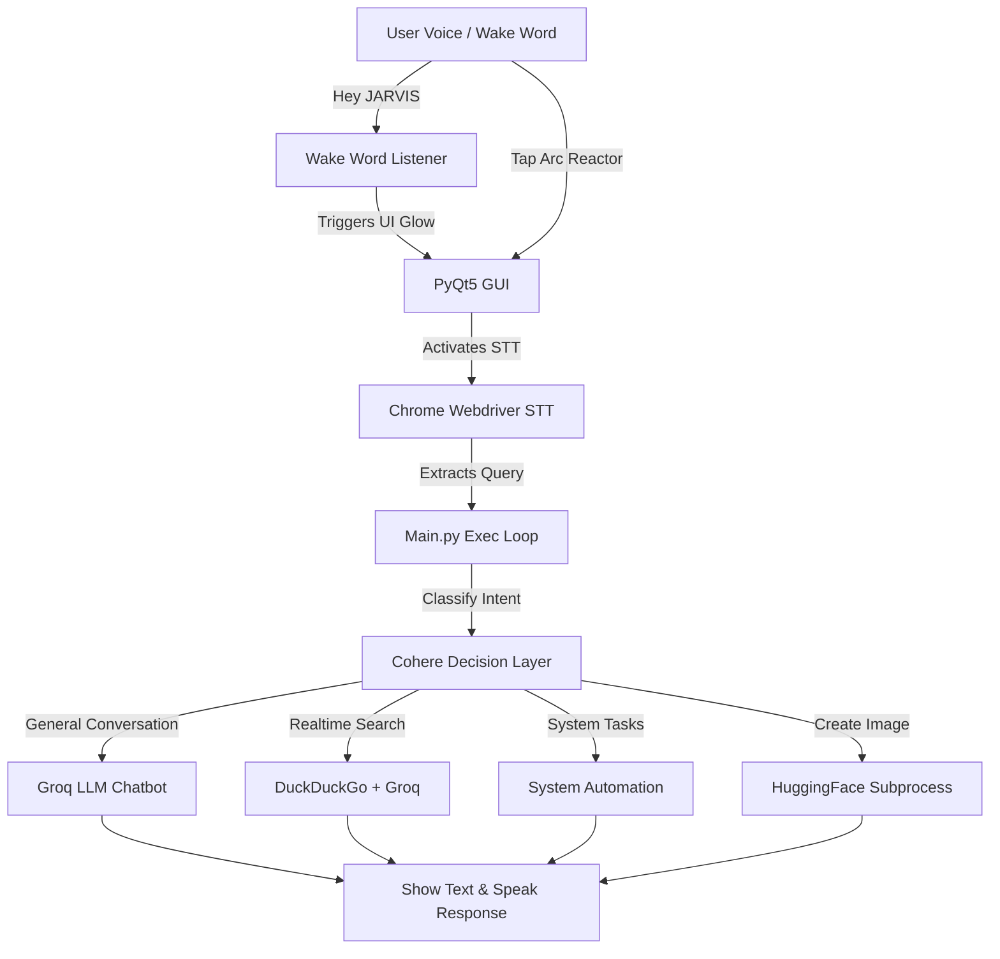

# 🦾 JARVIS AI

JARVIS AI is a highly advanced, responsive virtual assistant application built with Python and PyQt5. Inspired by Tony Stark's assistant, JARVIS features a stunning futuristic graphical user interface, background wake word activation, real-time web search capabilities, system automation, and natural speech synthesis.

---

## ⚡ Features

*   **Futuristic GUI:** A modern, minimal interface featuring a dynamic central visualizer and an interactive **Iron Man Arc Reactor** status indicator:
    *   🔵 **Active (Listening):** Bright, glowing blue arc reactor.
    *   ⚫ **Standby (Available):** Dimmed, dark metal arc reactor.
*   **Automatic Wake Word:** Constantly monitors in the background for **"Hey JARVIS"** or **"JARVIS"** using a lightweight listener to automatically trigger listening mode.
*   **Intelligent Intent Classifier:** Utilizes a Cohere-based Decision-Making Model to classify queries into general conversation, real-time queries, system automations, or image generation.
*   **Real-Time Internet Search:** Searches the live web using DuckDuckGo to answer queries needing up-to-date information.
*   **System Automation:** Automates system tasks such as opening/closing apps, executing Google/YouTube searches, controlling volume, and setting reminders.
*   **AI Image Generation:** Generates images locally using HuggingFace / Python subprocesses based on description prompts.
*   **Natural Voice Synthesis:** Uses Microsoft Edge TTS for highly realistic and natural-sounding vocal responses.
*   **Clean Architecture:** Fully relative, cross-platform path structure with zero hardcoded paths, cleanly caching all runtime states inside the `Data/` folder.

---

## 🛠️ Technology Stack

| Layer | Technology |
| :--- | :--- |
| **Frontend UI** | PyQt5 (Python QWidgets & QStackedWidget) |
| **Core Language** | Python 3.13 |
| **Wake Word Listener** | SpeechRecognition, PyAudio, PortAudio |
| **Speech-to-Text** | Headless Selenium (Chrome Webdriver) |
| **Text-to-Speech** | Edge-TTS, Pygame (audio mixer) |
| **AI LLM Engine** | Groq API (`llama-3.3-70b-versatile`) |
| **Intent Classification** | Cohere API (`command-a-03-2025`) |
| **Web Crawling** | BeautifulSoup4, DuckDuckGo API (DDGS) |
| **Automation** | PyWhatKit, Keyboard, Subprocess |

---

## 📊 System Architecture & Workflow



---

## 📁 File Structure

```text
JARVIS AI/
├── Backend/
│   ├── Automation.py            # Opens/closes apps, searches Google/YouTube, system controls
│   ├── Chatbot.py               # Connects with Groq LLM to handle conversational chat
│   ├── ImageGeneration.py       # Handles AI image generation tasks
│   ├── Model.py                 # Cohere Intent Classifier (DMM)
│   ├── RealTime_Search_Engine.py# DuckDuckGo search + Groq answer compiler
│   ├── SpeechToText.py          # Selenium-based voice-to-text listener
│   └── TextToSpeech.py          # Converts textual outputs into Edge-TTS speech
├── Data/
│   ├── ChatLog.json             # Conversational message log storage
│   ├── Database.data            # Holds formatted chat history
│   ├── Mic.data                 # Real-time state file of the microphone (True/False)
│   ├── Responses.data           # Temporary storage for assistant text response
│   ├── Status.data              # System status state ("Available...", "Listening...")
│   └── Voice.html               # Headless browser HTML listener template
├── Frontend/
│   ├── Files/                   # GUI visual assets (Icons, JPGs, GIFs)
│   └── Graphics/
│       └── GUI.py               # Main PyQt5 application graphical layout & window events
├── .env                         # Local environment configuration (API keys & User configs)
├── .gitignore                   # Safe configuration ignoring venv, .env, and Data/
├── Main.py                      # Multi-threaded program runner and task coordinator
└── Requirements.txt             # Project library dependency list
```

---

## 🚀 Installation & Setup

### Prerequisites
*   Python 3.13 or lower installed
*   Google Chrome installed
*   PortAudio installed on your system:
    *   **macOS (via Homebrew):** `brew install portaudio`
    *   **Debian/Ubuntu:** `sudo apt-get install portaudio19-dev`

### Installation Steps
1.  **Clone the repository:**
    ```bash
    git clone https://github.com/Himanshu-Singh11/JARVIS-AI.git
    cd JARVIS-AI
    ```

2.  **Set up Virtual Environment:**
    ```bash
    python3 -m venv venv
    source venv/bin/activate  # On Windows: venv\Scripts\activate
    ```

3.  **Install dependencies:**
    ```bash
    pip install -r Requirements.txt
    ```

4.  **Create `.env` Configuration file:**
    Create a `.env` file in the root folder and add your keys:
    ```ini
    GroqAPIKey=your_groq_api_key_here
    CohereAPIKey=your_cohere_api_key_here
    HuggingFaceAPIKey=your_huggingface_api_key_here
    Username=Your_Name
    Assistantname=JARVIS
    InputLanguage=en
    OutputLanguage=en
    AssistantVoice=en-CA-LiamNeural
    ```

5.  **Run JARVIS:**
    ```bash
    python Main.py
    ```

---

## 🔒 License
This project is open-source. Please feel free to use and adapt it for personal projects!
